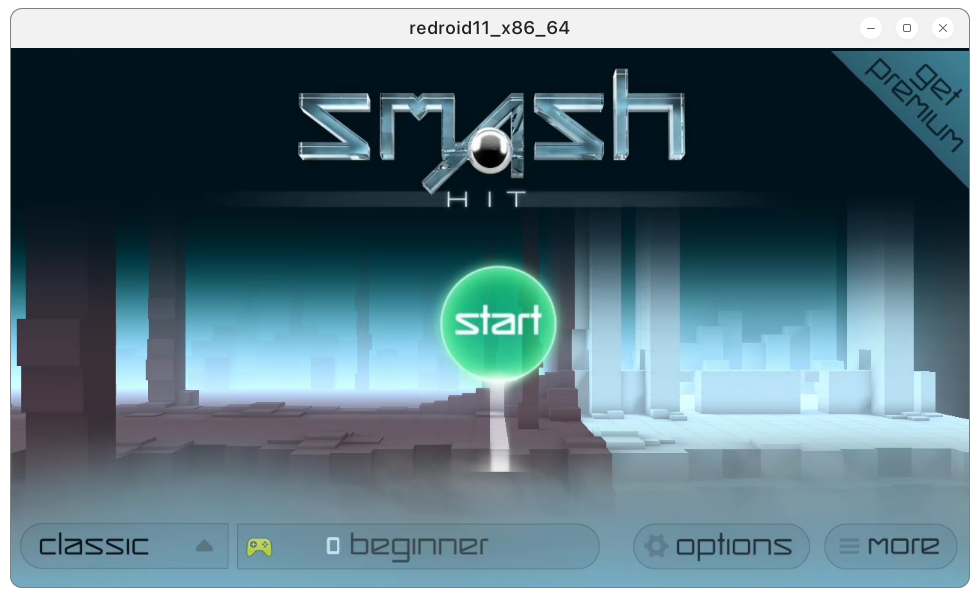
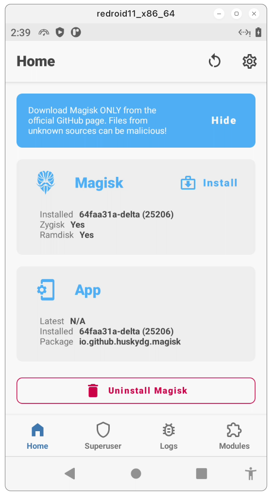
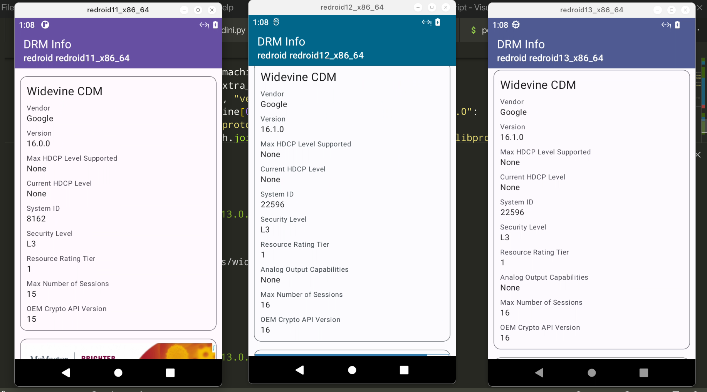

# Remote-Android Script

This script adds Gapps, Magisk and libndk to redroid **without recompiling the entire image**
If redroid-script doesn't work, please create an issue

## Dependencies
- lzip

## Specify container type

Specify container type. Default is docker

option:
```
 -c {docker,podman}, --container {docker,podman}
```


## Specify an Android version

Use `-a` or `--android-version` to specify the Android version of the image being pulled. The value can be `8.1.0`, `9.0.0`, `10.0.0`, `11.0.0`, `12.0.0`, `12.0.0_64only` or `13.0.0`. The default is 11.0.0.

```bash
# pull the latest image
python redroid.py -a 11.0.0
```

## Add OpenGapps to ReDroid image


```bash
python redroid.py -g
```

## Add liteGapps to ReDroid image

```bash
python redroid.py -lg
```

## Add MindTheGapps to ReDroid image

```bash
python redroid.py -mtg
```

## Add libndk arm translation to ReDroid image


libndk_translation from guybrush firmware.

libndk seems to have better performance than libhoudini on AMD.

```bash
python redroid.py -n
```

## Add Magisk to ReDroid image


Zygisk and modules like LSPosed should work. 


```bash
python redroid.py -m
```

## Add widevine DRM(L3) to ReDroid image



```
python redroid.py -w
```


## Example

This command will add Gapps, Magisk, Libndk, Widevine to the ReDroid image at the same time.

```bash
python redroid.py -a 11.0.0 -gmnw
```

Then start the docker container.

```bash
docker run -itd --rm --privileged \
    -v ~/data:/data \
    -p 5555:5555 \
    redroid/redroid:11.0.0-gapps-ndk-magisk-widevine \
ro.product.cpu.abilist=x86_64,arm64-v8a,x86,armeabi-v7a,armeabi \
    ro.product.cpu.abilist64=x86_64,arm64-v8a \
    ro.product.cpu.abilist32=x86,armeabi-v7a,armeabi \
    ro.dalvik.vm.isa.arm=x86 \
    ro.dalvik.vm.isa.arm64=x86_64 \
    ro.enable.native.bridge.exec=1 \
    ro.dalvik.vm.native.bridge=libndk_translation.so \
    ro.ndk_translation.version=0.2.2 \
```

If you need to use libndk on `redroid:12.0.0_64only` image, you should start the container with the following command

```bash
docker run -itd --rm --privileged \
    -v ~/data12:/data \
    -p 5555:5555 \
    redroid/redroid:12.0.0_64only-ndk \
    androidboot.use_memfd=1 \
    ro.product.cpu.abilist=x86_64,arm64-v8a \
    ro.product.cpu.abilist64=x86_64,arm64-v8a \
    ro.dalvik.vm.isa.arm64=x86_64 \
    ro.enable.native.bridge.exec=1 \
    ro.dalvik.vm.native.bridge=libndk_translation.so
```

## Troubleshooting

- Magisk installed: N/A

  According to some feedback from WayDroid users, changing the kernel may solve this issue. https://t.me/WayDroid/126202

- The device isn't Play Protect certified
    1. Run below command on host
    ```
    adb root
    adb shell 'sqlite3 /data/data/com.google.android.gsf/databases/gservices.db \
    "select * from main where name = \"android_id\";"'
    ```

    2. Grab device id and register on this website: https://www.google.com/android/uncertified/

- libndk doesn't work
  
    I only made it work on `redroid/redroid:11.0.0`. Also, turning on Zygisk seems to break libndk for 32 bit apps, but arm64 apps still work.
    
- libhoudini doesn't work
  
    I have no idea. I can't get any version of libhoudini to work on redroid.


## Credits
1. [remote-android](https://github.com/remote-android)
2. [waydroid_script](https://github.com/casualsnek/waydroid_script)
3. [Magisk Delta](https://huskydg.github.io/magisk-files/)
4. [vendor_intel_proprietary_houdini](https://github.com/supremegamers/vendor_intel_proprietary_houdini)

